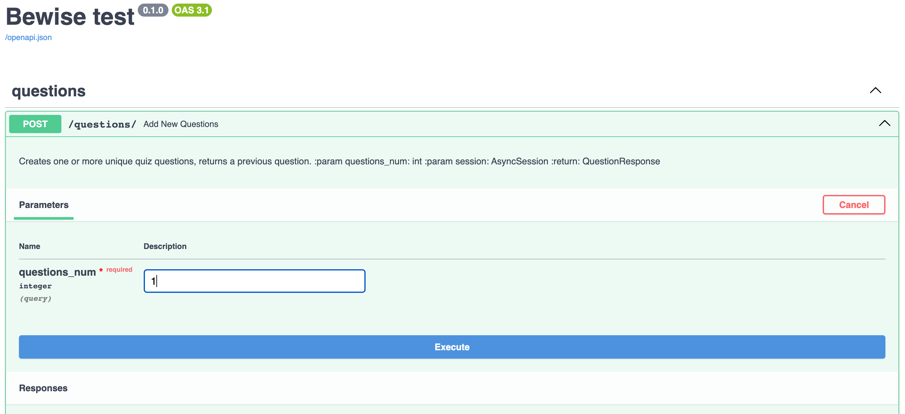
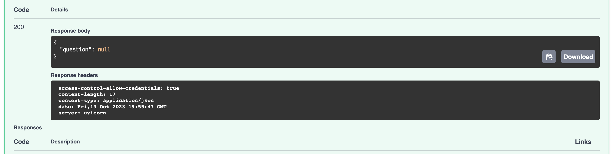
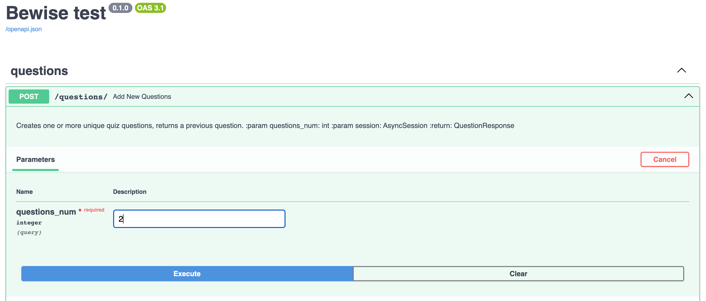
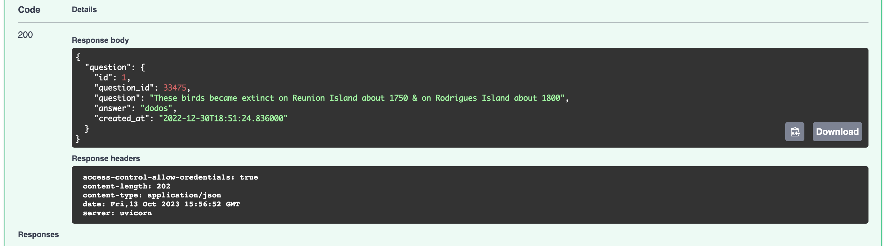

# be_test

Задание:
1. С помощью Docker (предпочтительно - docker-compose) развернуть образ с любой опенсорсной СУБД (предпочтительно - PostgreSQL). Предоставить все необходимые скрипты и конфигурационные (docker/compose) файлы для развертывания СУБД, а также инструкции для подключения к ней. Необходимо обеспечить сохранность данных при рестарте контейнера (то есть - использовать volume-ы для хранения файлов СУБД на хост-машине.


2. Реализовать на Python3 простой веб сервис (с помощью FastAPI или Flask, например), выполняющий следующие функции:
В сервисе должно быть реализовано REST API, принимающее на вход POST запросы с содержимым вида {"questions_num": integer}  ;

После получения запроса сервис, в свою очередь, запрашивает с публичного API (англоязычные вопросы для викторин) https://jservice.io/api/random?count=1 указанное в полученном запросе количество вопросов.
Далее, полученные ответы должны сохраняться в базе данных из п. 1, причем сохранена должна быть как минимум следующая информация (название колонок и типы данный можете выбрать сами, также можете добавлять свои колонки): 1. ID вопроса, 2. Текст вопроса, 3. Текст ответа, 4. - Дата создания вопроса. В случае, если в БД имеется такой же вопрос, к публичному API с викторинами должны выполняться дополнительные запросы до тех пор, пока не будет получен уникальный вопрос для викторины.
Ответом на запрос из п.2.a должен быть предыдущей сохранённый вопрос для викторины. В случае его отсутствия - пустой объект.

3. В репозитории с заданием должны быть предоставлены инструкции по сборке докер-образа с сервисом из п. 2., его настройке и запуску. А также пример запроса к POST API сервиса.

4. Желательно, если при выполнении задания вы будете использовать docker-compose, SqlAalchemy,  пользоваться аннотацией типов.

## Сборка docker-образа и запуск docker compose

Скачайте код:
```
https://github.com/Woodwine/be_test.git
```
Перейдите в каталог проекта.
Проверьте, что у вас установлен docker и docker compose:
```
docker --version
docker-compose --version
```
Убедитесь, что Docker daemon запущен (команда для Linux):
```
sudo systemctl status docker
```
Если docker не запущен - запустите его:
```
sudo systemctl start docker
```
Запустите сборку контейнеров:
```
docker compose build
```
Старт приложения:
```
docker compose up
```
Приложение будет доступно по адресу http://localhost:8000/questions. Автоматически сгенерированная документация доступна по адресу http://localhost:8000/docs, в ней же можно протестировать отправку запросов.

Переменные окружения в docker-compose.yaml прописаны напрямую, но вы можете вынести их в отдельный файл(например .env) и прописать в docker-compose.yaml ссылку на этот файл вместо переменной environment. Для примера:
```
env_file:
  - .env
```

## Примеры запросов

После запуска контейнеров пробуем сделать запрос к нашему API. Так как база данных в контейнере еще пуста, вернется не вопрос, а пустое сообщение:





При первом запросе мы сохранили 1 вопрос в базу данных и все последующие ответы уже не будут пустыми:






